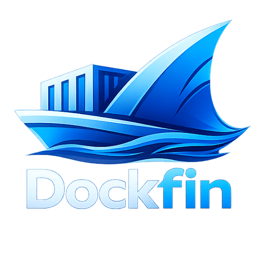

<p align="center">
  
</p>

# Dockfin

**Deploy apps on your own server** — like Heroku / Vercel, but self-hosted.

One Docker image = API + dashboard. MIT license. Your data stays on your VPS.

| Registry | Image |
|----------|--------|
| **GitHub Packages (GHCR)** — production default | `ghcr.io/foisalislambd/dockfin:latest` |
| [Docker Hub](https://hub.docker.com/r/foisalislambd/dockfin) | `foisalislambd/dockfin:latest` |

---

## Install on a production server

You need a **Ubuntu/Debian VPS** with a public IP. That’s it.

### One command (recommended)

```bash
curl -fsSL https://raw.githubusercontent.com/foisalislambd/dockfin/main/scripts/install.sh | sudo bash
```

This **pulls from GitHub Container Registry**, then:

- Installs Docker (if missing)
- Generates secure secrets
- Starts Postgres + Dockfin
- Opens the dashboard on **port 8000** (80/443 free for Traefik)

Then open:

```text
http://YOUR_SERVER_IP:8000/
```

1. **Register** your admin account  
2. The VPS is added as a server for you  
3. Create a **project** and deploy  

**Update anytime:**

```bash
cd /data/dockfin && sudo docker compose pull && sudo docker compose up -d
```

**Pin a release version:**

```bash
sudo DOCKFIN_VERSION=1.0.9 \
  bash -c 'curl -fsSL https://raw.githubusercontent.com/foisalislambd/dockfin/main/scripts/install.sh | bash'
```

### Useful commands after install

```bash
curl -s http://YOUR_SERVER_IP:8000/health
curl -s http://YOUR_SERVER_IP:8000/api/v1/version

cd /data/dockfin && sudo docker compose logs -f dockfin
cd /data/dockfin && sudo docker compose down
cd /data/dockfin && sudo docker compose up -d
```

Everything important lives in `/data/dockfin`. You don’t need to edit `.env` by hand.

---

## What you can deploy

- Apps — Dockerfile, Compose, image, Railpack, static  
- Databases — Postgres, MySQL, MongoDB, Redis, and more  
- ~360 one-click service templates  
- Git webhooks, env vars, live deploy logs  

---

## Local development

### Docker (build from this repo)

```bash
git clone https://github.com/foisalislambd/dockfin.git
cd dockfin
sudo bash scripts/install-dev.sh
```

Builds `dockfin:local` into `/data/dockfin` (same dir as production; no registry pull).

### Go + Vite (hot reload)

```bash
git clone https://github.com/foisalislambd/dockfin.git
cd dockfin
cp .env.example .env   # set DOCKFIN_MASTER_KEY (32+ chars)

docker compose -f deploy/compose/docker-compose.yml up -d postgres
go run ./cmd/dockfin migrate && go run ./cmd/dockfin serve

cd apps/web && npm install && npm run dev   # http://localhost:5173
```

| Script | Use |
|--------|-----|
| `scripts/install.sh` | **Production** — pull `ghcr.io/foisalislambd/dockfin` |
| `scripts/install-dev.sh` | **Dev** — build local image from source |

---

## Releases

Push to `main` publishes the same version to GitHub Release + Docker Hub + GHCR  
(`1.0.0` … `1.0.9` → `1.1.0`).

**Skip a release** — put this in the commit message:

```text
[skip release]
```

Example: `git commit -m "docs: tweak README [skip release]"`

---

## Docs & help

| Link | |
|------|--|
| [Features](docs/FEATURES.md) | Checklist |
| [Architecture](docs/ARCHITECTURE.md) | Design |
| [Contributing](CONTRIBUTING.md) | PRs |
| [Security](SECURITY.md) | Report issues privately |
| [Changelog](CHANGELOG.md) | Releases |

---

## License

[MIT](LICENSE)
